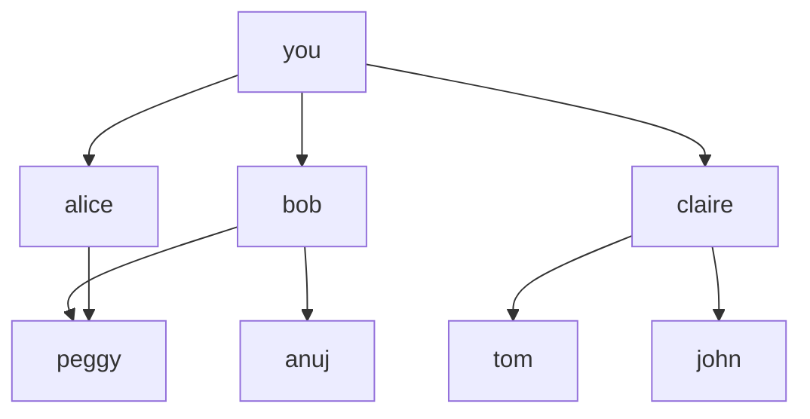

# Лекция 10. Графы. Поиск в ширину

## Тема лекции
Графы. Breadth-First Search. Очередь. Кратчайший путь в невзвешенном графе.

## О чем эта лекция
В этой лекции мы начинаем работать с графами.
Граф нужен тогда, когда мы хотим моделировать связи между объектами: людьми в социальной сети, городами на карте, страницами сайта, комнатами в здании или клетками в сетке.

Главный алгоритм этой лекции — **поиск в ширину (BFS, Breadth-First Search)**.
BFS обходит вершины по уровням:
- сначала всех прямых соседей стартовой вершины
- потом соседей этих соседей
- потом следующий уровень

Именно поэтому BFS подходит для задач, где нужно:
- проверить, существует ли путь
- найти ближайший подходящий объект
- найти кратчайший путь в **невзвешенном** графе

## Основные идеи

### 1. Из чего состоит граф
Граф состоит из:
- **вершин (nodes, vertices)**
- **рёбер (edges)**

Если одна вершина напрямую соединена с другой, то такие вершины называются **соседями (neighbors)**.

### 2. Направленный и ненаправленный граф
Граф может быть:
- **направленным** — связь имеет направление
- **ненаправленным** — связь работает в обе стороны

Пример:
Если Bob указывает на Anuj, это не означает, что Anuj автоматически указывает на Bob.
Это направленный граф.

### 3. Как хранить граф в коде
Удобный способ хранения графа — **список смежности (adjacency list)**.
В JavaScript его часто представляют как объект:

```js
const graph = {
    you: ['alice', 'bob', 'claire'],
    bob: ['anuj', 'peggy'],
    alice: ['peggy'],
    claire: ['tom', 'john'],
    anuj: [],
    peggy: [],
    tom: [],
    john: [],
}
```

Здесь:
- каждый ключ — это вершина
- каждый массив — это список её соседей

## Почему BFS использует очередь
BFS обязан обрабатывать вершины в том порядке, в котором они были обнаружены.
Именно поэтому он использует **очередь (queue)**.

Очередь работает по правилу **FIFO**:
**First In, First Out**.

Это важно, потому что вершины первого уровня должны быть проверены раньше вершин второго уровня.
Иначе можно пропустить более близкий ответ и найти более дальний раньше.

## Главная интуиция BFS
На BFS удобно смотреть как на волну.

Вы стартуете из одной вершины.
Потом посещаете:
1. все вершины на расстоянии одного ребра
2. все вершины на расстоянии двух рёбер
3. все вершины следующего уровня

Поэтому BFS нужен там, где в условии есть:
- минимальное число шагов
- минимальное число пересадок
- ближайший друг, город, комната, клетка или состояние

## Важное замечание про кратчайший путь
BFS находит кратчайший путь только в **невзвешенном графе**.
Это значит, что у всех рёбер одинаковая “стоимость”, и расстояние измеряется количеством рёбер.

Если рёбра имеют разные веса, обычного BFS уже недостаточно.

## Пример 1. Найти продавца
Предположим, нужно найти первого человека, у которого в имени есть буква `m`.

```js
const graph = {
    you: ['alice', 'bob', 'claire'],
    bob: ['anuj', 'peggy'],
    alice: ['peggy'],
    claire: ['tom', 'john'],
    anuj: [],
    peggy: [],
    tom: [],
    john: [],
}

const personIsSeller = name => name.includes('m')

function searchSeller(graph, start, predicate) {
    const queue = [...(graph[start] || [])]
    const visited = new Set([start])

    while (queue.length > 0) {
        const person = queue.shift()

        if (visited.has(person)) continue
        visited.add(person)

        if (predicate(person)) {
            return person
        }

        queue.push(...(graph[person] || []))
    }

    return null
}

console.log(searchSeller(graph, 'you', personIsSeller))
```

### Зачем нужен `visited`
Без `visited` алгоритм может:
- проверять одну и ту же вершину много раз
- зациклиться, если в графе есть цикл

Поэтому `visited` в нормальной реализации BFS обязателен.

## Пример 2. Проверка существования пути

```js
function hasPath(graph, start, end) {
    if (start === end) return true

    const queue = [start]
    const visited = new Set([start])

    while (queue.length > 0) {
        const current = queue.shift()

        for (const neighbor of graph[current] || []) {
            if (neighbor === end) return true

            if (!visited.has(neighbor)) {
                visited.add(neighbor)
                queue.push(neighbor)
            }
        }
    }

    return false
}
```

## Пример графа в Mermaid
Обычно граф в Mermaid записывают в два шага:
1. сначала объявляют вершины
2. потом задают связи между ними



## Как посмотреть Mermaid в VS Code
Чтобы граф отрисовывался прямо в VS Code:

1. Откройте **Extensions**
2. Установите **Markdown Preview Mermaid Support**
3. Откройте этот `.md` файл
4. Нажмите **Ctrl + Shift + V**

## Сложность алгоритма
BFS работает за:
- **O(V + E)** по времени
- **O(V)** по дополнительной памяти в стандартной реализации

Где:
- `V` — количество вершин
- `E` — количество рёбер

## Когда использовать BFS
Используйте BFS, если в задаче спрашивают:
- можно ли добраться до этой вершины
- кто является ближайшей подходящей вершиной
- как найти минимальное число шагов, прыжков, пересадок или ходов
- какие клетки можно обойти по уровням

## Типичные ошибки
- забыть про `visited`
- использовать стек вместо очереди
- думать, что BFS всегда работает для взвешенных графов
- поздно помечать вершины как посещённые
- путать представление графа и сам алгоритм обхода

## Выводы
В этой лекции мы изучили:
- что такое граф
- что такое вершины, рёбра и соседи
- разницу между направленным и ненаправленным графом
- почему BFS использует очередь
- как реализовать BFS на JavaScript
- зачем нужен `visited`
- почему BFS находит кратчайший путь только в невзвешенном графе

## Queue in Python, Java, JavaScript, and TypeScript

A queue is a FIFO data structure: **first in, first out**.

### Where queues exist and where they do not

| Language | Built-in queue type | Common way to use a queue |
|---|---|---|
| Python | Yes, in the standard library | `collections.deque` |
| Java | Yes, in the standard library | `Queue`, `LinkedList`, `ArrayDeque` |
| JavaScript | No separate built-in queue type | array or custom queue class |
| TypeScript | No separate built-in queue type | array or custom queue class |

### English

- In **Python**, queues are available through the standard library, most commonly with `collections.deque`.
- In **Java**, queues are available through the standard library using `Queue` and implementations such as `LinkedList` or `ArrayDeque`.
- In **JavaScript**, there is no separate built-in queue type, so developers usually use an array or write a custom queue class.
- In **TypeScript**, the situation is the same as in JavaScript, because TypeScript does not add a built-in queue structure.

### Русский

- В **Python** очередь есть в стандартной библиотеке, чаще всего используют `collections.deque`.
- В **Java** очередь есть в стандартной библиотеке через `Queue` и реализации вроде `LinkedList` или `ArrayDeque`.
- В **JavaScript** отдельного встроенного типа очереди нет, поэтому обычно используют массив или пишут свой класс очереди.
- В **TypeScript** ситуация такая же, как в JavaScript, потому что TypeScript не добавляет встроенную очередь.

### Examples

#### Python

```python
from collections import deque

queue = deque()
queue.append("alice")
queue.append("bob")
print(queue.popleft())  # alice
```
Java
```java
import java.util.Queue;
import java.util.LinkedList;

public class Main {
    public static void main(String[] args) {
        Queue<String> queue = new LinkedList<>();
        queue.add("alice");
        queue.add("bob");
        System.out.println(queue.poll()); // alice
    }
}
```
JavaScript
```javascript
const queue = [];
queue.push("alice");
queue.push("bob");
console.log(queue.shift()); // alice
```
TypeScript
```typescript
const queue: string[] = [];
queue.push("alice");
queue.push("bob");
console.log(queue.shift()); // alice
```