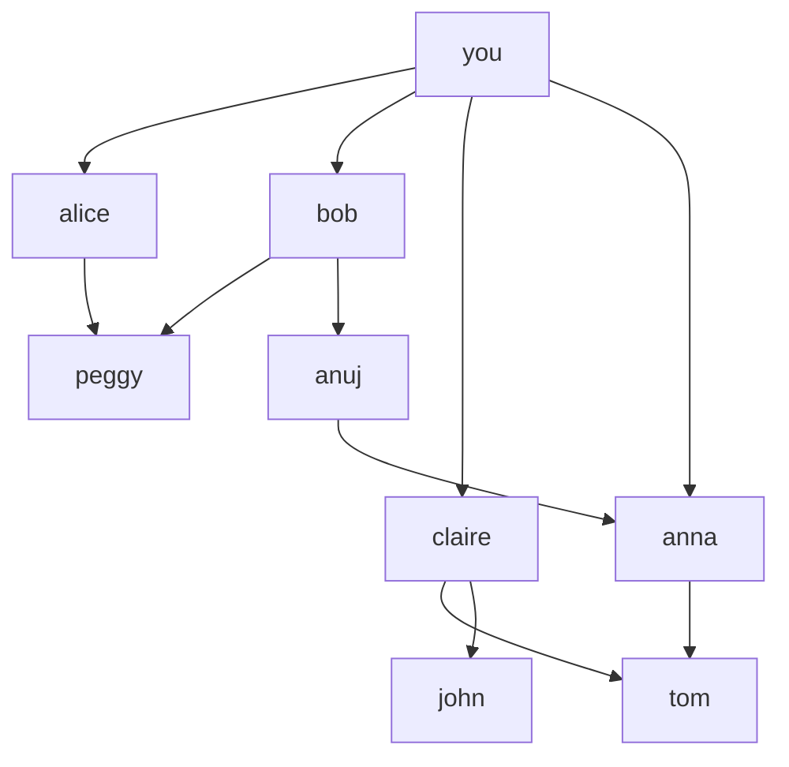
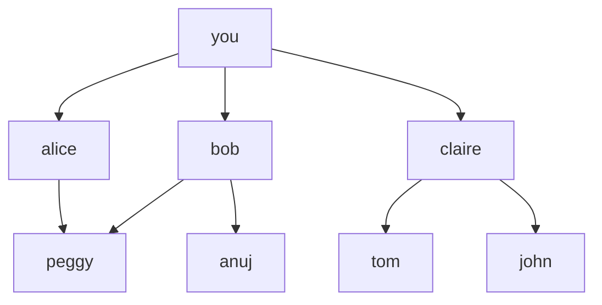
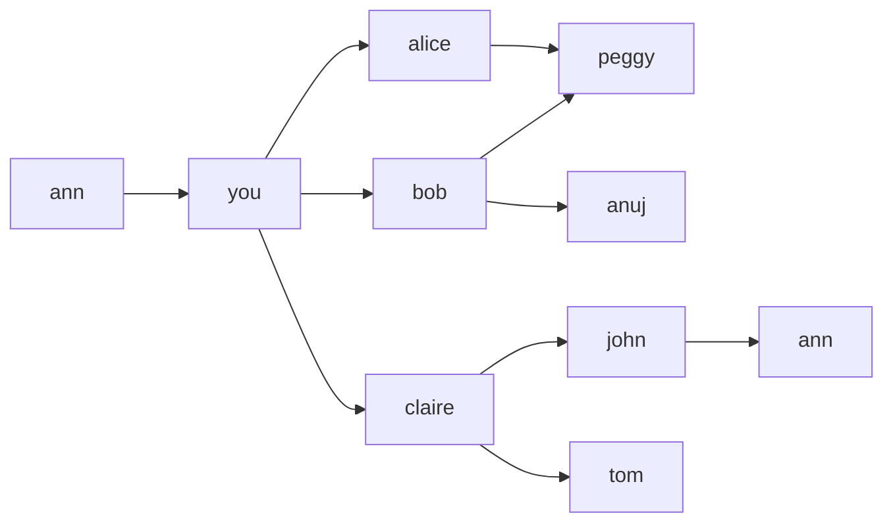

```md
# Lecture 10. Graphs and Breadth-First Search

## What this graph shows

This is a directed graph.
Each node is a person.
Each arrow shows who is connected to whom.

## How to open the diagram in VS Code

1. Install the extension **Markdown Preview Mermaid Support**
2. Open this `.md` file
3. Press **Ctrl + Shift + V**
4. The Mermaid block will be rendered as a graph


## Как установить диаграмы в VSCode
1. Открой Extensions в VS Code.

2. Найди Markdown Preview Mermaid Support.

3. Установи его.

4. Нажми Reload после установки.

5. Снова открой preview через Ctrl + Shift + V.
```

## Graph example



# Friends graph



    # Граф друзей


### How to write a graph in Mermaid

We usually write a graph in two steps:

1. First, we declare the nodes.
2. Then, we describe the connections between the nodes.

This order makes the graph easier to read.
First, we can clearly see which nodes exist in the graph.
After that, we can see how they are connected.

A node is written like this:

`you["you"]`

Here:
- `you` is the internal node name
- `"you"` is the label shown in the diagram

A connection between two nodes is written like this:

`you --> alice`

This means there is an arrow from `you` to `alice`.

### Как записывать граф в Mermaid

Обычно граф записывают в два шага:

1. Сначала объявляют вершины.
2. Потом описывают связи между вершинами.

Такой порядок делает граф более понятным.
Сначала мы видим, какие вершины вообще есть в графе.
После этого мы видим, как они соединены друг с другом.

Вершина записывается так:

`you["you"]`

Здесь:
- `you` — это внутреннее имя вершины
- `"you"` — это подпись, которая будет показана на схеме

Связь между двумя вершинами записывается так:

`you --> alice`

Это означает, что из `you` идёт стрелка к `alice`.